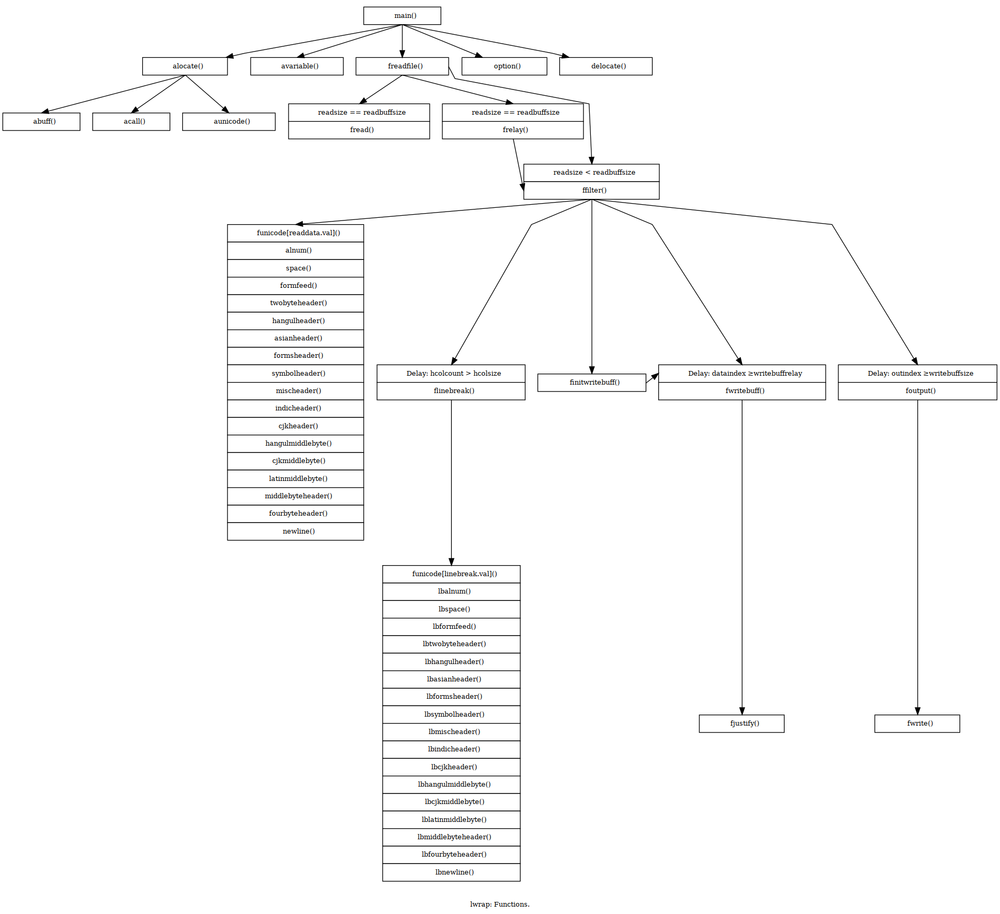
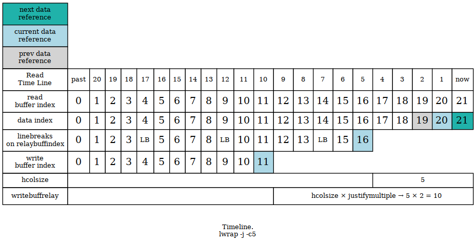

# lwrap
Line wrap text input according to user defined line width.

## Compile install and uninstall

* For linux/unix system:  
required header files:  
stdio.h  
stdlib.h  
unistd.h  
```
Following commands do Not use sudo
for best security precaution.
> cd src/
> source lwrap.sh
> lwrap.config
> lwrap.make
> lwrap.install
> man lwrap
> lwrap.uninstall
```
## Use with vim
:[range]!lwrap -j60

* Testing with different line width back and forth.

   The most flexible way of using lwrap with vim.


## Examples

* Output screenshots in different natural languages.

  lwrap support unicode utf-8 codepage. The actual  
line width consistency depends on the input language  
font glyph width.

  The default line break is ascii space plus newline,  
  which can be changed with command option to a single  
  newline. This is because ascii space occasionally  
  been used as word and name separator in asian languages.


## For developers

* Function calls

  One 255 elements array been created as a "filter" for each  
input byte. Each element is a function pointer, which execute  
a function call based on that input byte. By doing this  
we avoide as many as possible if-else cluster.

  The same filter applys for the last byte before each line  
break. This time the array element will use another pointer  
to execute a function call.

  It seems we introduced a lot of overhead by doing many  
function calls. But the benefits of decreased if-else cluster  
and minimal function size overcome some hundred millisecounds  
in decreased speed efficiency.



Timeline



## Reporting a bug and security issues

github.com/netcrop/lwrap/issues

## License

[GNU General Public License version 2 (GPLv2)](https://github.com/netcrop/lwrap/COPYING)
