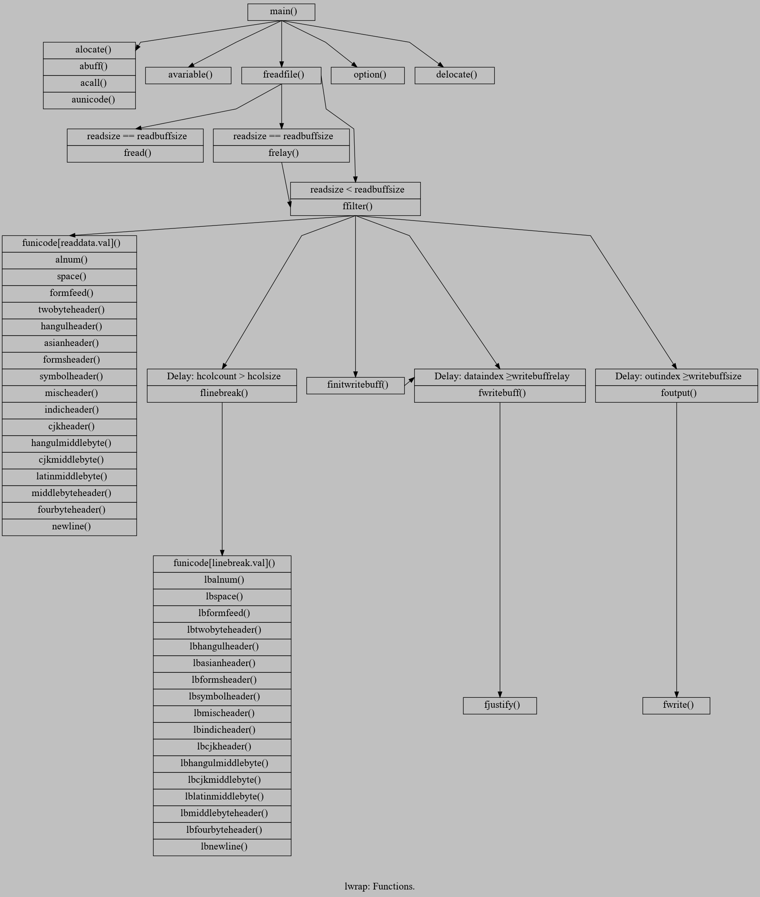

# lwrap
Line wrap text input according to user defined line width.

## How to install

For linux/unix system:

cd src/
source lwrap.sh
lwrap.config
lwrap.make
lwrap.install lwrap

## Use with vim
:[range]!lwrap -j60

## Examples

Output screenshots in different natural languages.

## For developers

Function calls

Timeline

## Reporting a bug and security issues

github.com/netcrop/lwrap/issues

## License

[GNU General Public License version 2 (GPLv2)](https://github.com/netcrop/lwrap/COPYING)
